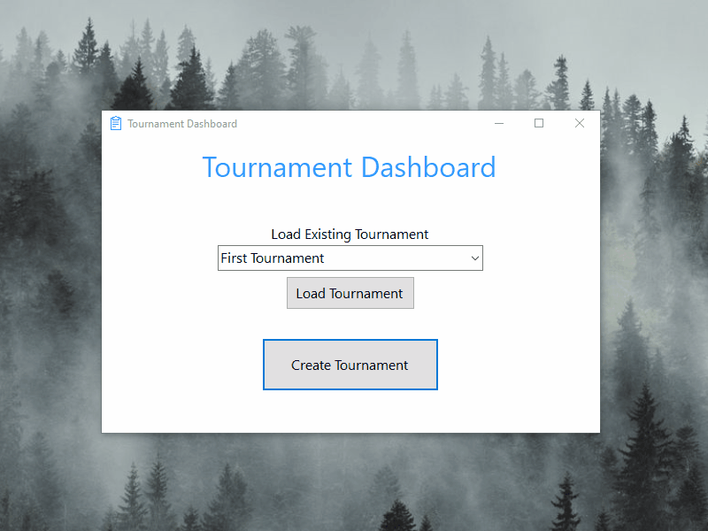

# tournament_tracker
A simple application that can be used to track progress in any given single-elimination tournament. 

# Description:

This application has a Three-tier architecture:

- Presentation layer: WinForms (C#, .NET Core);
- Business layer: Class Library (C#, .NET Core);
- Data layer (option 1): Local MS Server database;
- Data layer (option 2): Local CSV file-based database.

# Note: 
I, personally, don't take credit for the application idea or design in any way. I wrote this project during studying Tim Corey's "C# Application from Start to Finish" course relying on videos and textbook instructions (https://iamtimcorey.com/). 

At the same time, I wrote this application from A to Z with my own hands, including User Interface, Business Logic Class Library, and two databases (please, refer to Description above for detailed information).

There are some item I've learn along the way:

- WinForms UI (.NET Core);
- SQL database (full development process from start to finish, stored procedures);
- Dapper M-ORM (object-relational mapping);
- CSV file database;
- Linq (sorting, filtering, other);
- Three-tier architecture experience;
- Debugging (conditional breakpoints, other);
- Repository pattern (IDataConnection);
- Facade pattern (IRequester);
- Error handling (input validation, exception handling);
- Refactoring (method extraction, access management, other);
- Emailing via SMTP (System.Net.Mail, Papercut-SMTP);
- Sms sending (Twilio's REST APIs);
- XML comments.

# P.s.

Please keep in mind, that the application is commited in a partly incomplete state. I made sure to delete Email and SMS logic before committing in respect to IAmTimCorey.com course licence agreement, because the specified features are a part of paid members-only content and are restricted from unauthorised publishing. For the same reason I also didn't include database scripts.

# Demo:

